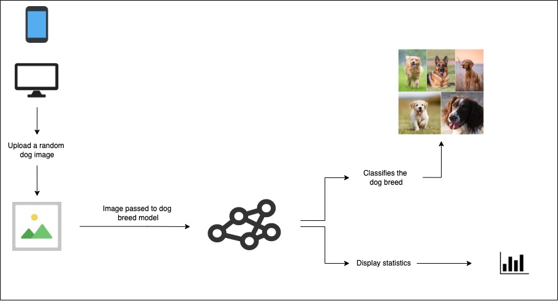

# Dog Breed Classifier

## Masalah apa yang ingin dipecahkan?

Untuk mengidentifikasi jenis anjing.

## Data-nya darimana?

Data yang digunakan diambil dari https://www.kaggle.com/c/dog-breed-identification/data

## Apa saja fitur dari aplikasi ini?

Beberapa hal yang dapat menjadi patokan pengerjaan aplikasi ini:
* Menggunakan `MobileNetV2` sebagai arsitektur model.
* Dapat mengklasifikasi 120 jenis anjing.
* Training dataset ada sekitar ~10000 gambar.
* Setiap jenis anjing memiliki rata-rata 82 gambar yang akan digunakan untuk melatih serta menvalidasi model yang digunakan.

## Apa yang dapat ditingkatkan lagi?

* Arsitektur model dapat dibandingkan dengan EfficientNet, ResNet dan dll.
* Dataset bisa ditingkatkan ~50000-100000 gambar dengan lebih dari >300 jenis anjing.

## Perbandingan ResNet vs. EfficientNet vs. MobileNet

Setiap model dilatih sebanyak 5 epochs pada training dataset.

https://tensorboard.dev/experiment/lm0IPlIPQ4qzORzzGTnaCw/#scalars

Dari hasil tersebut, MobileNet dapat disimpulkan bahwa dapat menghasilkan akurasi yang lebih tinggi per epochnya dibandingkan dari arsitektur lawannya.

## Cara menggunakan repository ini

* `app.py` untuk melakukan hosting aplikasi ini ke platform Streamlit.
* `big_dog_model.h5` merupakan model yang sudah dilatih dan siap digunakan di `app.py`.
* `helper.py` terisi beberapa fungsi yang nantinya digunakan untuk `app.py`.
* `labels.csv` merupakan file berisi label data yang sudah didownload dari Kaggle.
* `modelling_comparison.ipynb` adalah file pembandingan dari beberapa arsitektur yang akan digunakan.
* `modelling.ipynb` adalah **file utama** pengerjaan proyek ini.
* `requirements.txt` untuk keperluan hosting di Streamlit.